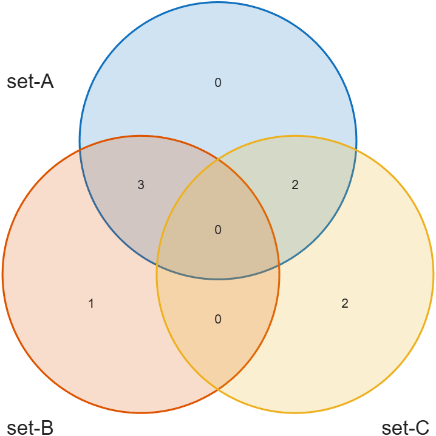
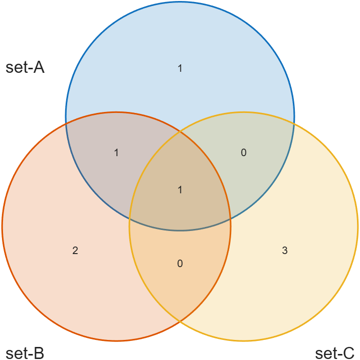
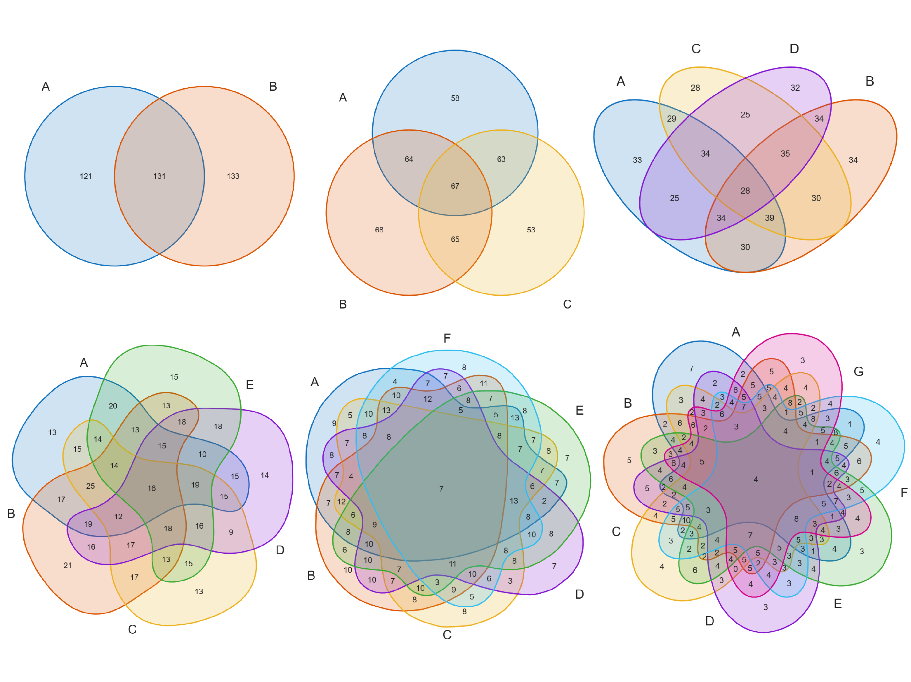
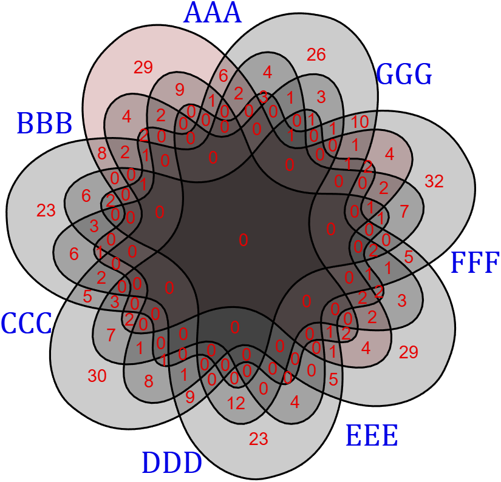
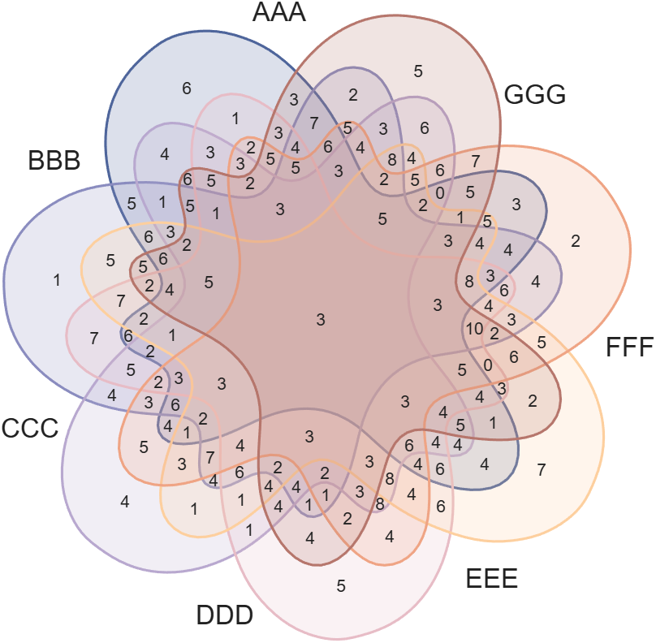

# venn diagram
Draw pretty venn diagram/plot/chart with 2-7 sets and 3 input formats(multiple arrays, boolean matrix, cell arrays with string entries).
Basic usage
## Input format 1: Multiple arrays
```matlab
A = [1, 2, 3, 4, 5];
B = [1, 3, 5, 7];
C = [2, 4, 6, 8];
% Create venn diagram object and draw.
VN1 = venn(A, B, C);
VN1.labelSet = {'set-A', 'set-B', 'set-C'};
VN1.draw();
```

## Input format 2: An m × n Boolean matrix, with m samples and n sets.
```matlab
%         [A, B, C]
boolABC = [1, 1, 0;
           1, 0, 1;
           1, 1, 0;
           1, 0, 1;
           1, 1, 0;
           0, 0, 1;
           0, 1, 0;
           0, 0, 1];
% Create venn diagram object and draw.
VN2 = venn(boolABC);
VN2.labelSet = {'set-A', 'set-B', 'set-C'};
VN2.draw();
```

## Input format 3: Cell arrays with string entries.
```matlab
A = {'apple', 'blueberry', 'peach'};
B = {'apple', 'cranberry', 'peach', 'mango'};
C = {'apple', 'orange', 'lemon', 'lime'};

% Create venn diagram object and draw.
VN3 = venn(A, B, C);
VN3.labelSet = {'set-A', 'set-B', 'set-C'};
VN3.draw();
```


## Supports Venn diagrams with 2–7 sets
```matlab
% Generate random Boolean matrix: 500 samples, 7 sets.
boolSet = randi([0, 1], [500, 7]);
for i = 2:7
    figure()
    % Initialize Venn diagram with first i sets.
    VN = venn(boolSet(:, 1:i));
    VN.labelSet = {'A', 'B', 'C', 'D', 'E', 'F', 'G'};
    VN.draw();
end
```

## Property setting
```matlab
% Generate random data for 7 sets (100 samples each)
X1 = randi([1, 500], [100, 1]);
X2 = randi([1, 500], [100, 1]);
X3 = randi([1, 500], [100, 1]);
X4 = randi([1, 500], [100, 1]);
X5 = randi([1, 500], [100, 1]);
X6 = randi([1, 500], [100, 1]);
X7 = randi([1, 500], [100, 1]);
XX = {X1, X2, X3, X4, X5, X6, X7};

% Create Venn diagram object and draw.
VN = venn(XX{1:7});
VN = VN.labels('AAA', 'BBB', 'CCC', 'DDD', 'EEE', 'FFF', 'GGG');
VN = VN.draw();

%% Property settings for the Venn diagram appearance
% Batch set properties for all polygons (black fill and black edges)
VN.setPatch('FaceColor', [0, 0, 0], 'EdgeColor', [0, 0, 0])
% Set properties for the first polygon specifically (dark red fill, black edges)
VN.setPatchN(1, 'FaceColor', [0.5, 0, 0], 'EdgeColor', [0, 0, 0])
% Set font properties for numerical value text (red color, size 14)
VN.setFont('Color', [0.9, 0, 0], 'FontSize', 14)
% Set font properties for category labels (blue color, size 25, Cambria font)
VN.setLabel('Color', [0, 0, 0.9], 'FontSize', 25, 'FontName', 'Cambria')
```


## Loop to set polygon colors
```matlab
% Create Venn diagram object and draw.
VN = venn(boolSet);
VN = VN.labels('AAA','BBB','CCC','DDD','EEE','FFF','GGG');
VN = VN.draw();

% Loop to set polygon(patch) colors.
colorList = [78 101 155; 138 140 191; 184 168 207;
            231 188 198; 253 207 158; 239 164 132; 182 118 108]./255;
for i = 1:7
    VN.setPatchN(i, 'FaceColor',colorList(i,:), 'EdgeColor',colorList(i,:))
end
```
